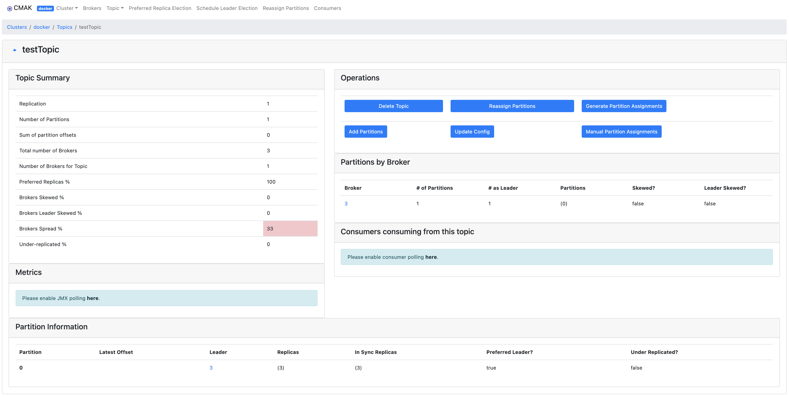

# 1 启动Kafka
```bash
$ docker-compose up -d
Creating network "docker_default" with the default driver
Creating zk2           ... done
Creating kafka_manager ... done
Creating zk1           ... done
Creating zk3           ... done
Creating kafka2        ... done
Creating kafka3        ... done
Creating kafka1        ... done

$ docker-compose ps -a
    Name                   Command               State                      Ports
----------------------------------------------------------------------------------------------------
kafka1          /etc/confluent/docker/run        Up      0.0.0.0:19092->19092/tcp, 9092/tcp
kafka2          /etc/confluent/docker/run        Up      0.0.0.0:29092->29092/tcp, 9092/tcp
kafka3          /etc/confluent/docker/run        Up      0.0.0.0:39092->39092/tcp, 9092/tcp
kafka_manager   /cmak/bin/cmak -Dpidfile.p ...   Up      0.0.0.0:9000->9000/tcp
zk1             /etc/confluent/docker/run        Up      0.0.0.0:12181->2181/tcp, 2888/tcp, 3888/tcp
zk2             /etc/confluent/docker/run        Up      0.0.0.0:22181->2181/tcp, 2888/tcp, 3888/tcp
zk3             /etc/confluent/docker/run        Up      0.0.0.0:32181->2181/tcp, 2888/tcp, 3888/tcp
```

# 2 验证功能

## 2.1 创建主题
```bash
$ docker exec -it kafka1 bash
```

```bash
[appuser@kafka1 ~]$ kafka-topics --zookeeper zk1:2181,zk2:2181,zk3:2181 --replication-factor 1 --partitions 1 --create --topic testTopic
Created topic testTopic.
[appuser@kafka1 ~]$ kafka-topics --zookeeper zk1:2181,zk2:2181,zk3:2181 --describe --topic testTopic
Topic: testTopic	PartitionCount: 1	ReplicationFactor: 1	Configs:
	Topic: testTopic	Partition: 0	Leader: 3	Replicas: 3	Isr: 3
```

## 2.2 发送消息
```bash
$ docker exec -it kafka1 bash
```

```bash
[appuser@kafka1 ~]$ kafka-console-producer --broker-list kafka1:19092,kafka2:29092,kafka3:39092 --topic=testTopic
>Hello
>Kafka
>
```

## 2.3 消费消息
```bash
$ docker exec -it kafka2 bash
```

```bash
[appuser@kafka2 ~]$ kafka-console-consumer --bootstrap-server kafka1:19092,kafka2:29092,kafka3:39092 --from-beginning --topic testTopic
Hello
Kafka
```

## 2.4 管理后台



# 3 性能测试

## 3.1 发送消息
```bash
$ docker exec -it kafka1 bash
```

```bash
[appuser@kafka1 ~]$ kafka-producer-perf-test --topic testTopic --num-records 1000 --record-size 10 --throughput -1 --producer-props acks=0 bootstrap.servers=kafka1:19092,kafka2:29092,kafka3:39092
1000 records sent, 1949.317739 records/sec (0.02 MB/sec), 5.02 ms avg latency, 442.00 ms max latency, 3 ms 50th, 16 ms 95th, 19 ms 99th, 442 ms 99.9th.
```

## 3.2 消费消息
```bash
$ docker exec -it kafka2 bash
```

```bash
[appuser@kafka2 ~]$ kafka-consumer-perf-test --broker-list kafka1:19092,kafka2:29092,kafka3:39092 --messages 1000 --topic testTopic --threads 1 --timeout 60000 --print-metrics --num-fetch-threads 6
start.time, end.time, data.consumed.in.MB, MB.sec, data.consumed.in.nMsg, nMsg.sec, rebalance.time.ms, fetch.time.ms, fetch.MB.sec, fetch.nMsg.sec
2021-01-14 06:35:14:863, 2021-01-14 06:35:18:517, 0.0095, 0.0026, 1000, 273.6727, 1610606118434, -1610606114780, -0.0000, -0.0000

Metric Name                                                                                                                      Value
consumer-coordinator-metrics:assigned-partitions:{client-id=consumer-perf-consumer-87406-1}                                    : 0.000
consumer-coordinator-metrics:commit-latency-avg:{client-id=consumer-perf-consumer-87406-1}                                     : 26.000
consumer-coordinator-metrics:commit-latency-max:{client-id=consumer-perf-consumer-87406-1}                                     : 26.000
consumer-coordinator-metrics:commit-rate:{client-id=consumer-perf-consumer-87406-1}                                            : 0.033
consumer-coordinator-metrics:commit-total:{client-id=consumer-perf-consumer-87406-1}                                           : 1.000
consumer-coordinator-metrics:failed-rebalance-rate-per-hour:{client-id=consumer-perf-consumer-87406-1}                         : 107.949
consumer-coordinator-metrics:failed-rebalance-total:{client-id=consumer-perf-consumer-87406-1}                                 : 1.000
consumer-coordinator-metrics:heartbeat-rate:{client-id=consumer-perf-consumer-87406-1}                                         : 0.000
consumer-coordinator-metrics:heartbeat-response-time-max:{client-id=consumer-perf-consumer-87406-1}                            : NaN
consumer-coordinator-metrics:heartbeat-total:{client-id=consumer-perf-consumer-87406-1}                                        : 0.000
consumer-coordinator-metrics:join-rate:{client-id=consumer-perf-consumer-87406-1}                                              : 0.033
consumer-coordinator-metrics:join-time-avg:{client-id=consumer-perf-consumer-87406-1}                                          : 3032.000
consumer-coordinator-metrics:join-time-max:{client-id=consumer-perf-consumer-87406-1}                                          : 3032.000
consumer-coordinator-metrics:join-total:{client-id=consumer-perf-consumer-87406-1}                                             : 1.000
consumer-coordinator-metrics:last-heartbeat-seconds-ago:{client-id=consumer-perf-consumer-87406-1}                             : -1.000
consumer-coordinator-metrics:last-rebalance-seconds-ago:{client-id=consumer-perf-consumer-87406-1}                             : 0.000
consumer-coordinator-metrics:partition-assigned-latency-avg:{client-id=consumer-perf-consumer-87406-1}                         : 0.000
consumer-coordinator-metrics:partition-assigned-latency-max:{client-id=consumer-perf-consumer-87406-1}                         : 0.000
consumer-coordinator-metrics:partition-lost-latency-avg:{client-id=consumer-perf-consumer-87406-1}                             : NaN
consumer-coordinator-metrics:partition-lost-latency-max:{client-id=consumer-perf-consumer-87406-1}                             : NaN
consumer-coordinator-metrics:partition-revoked-latency-avg:{client-id=consumer-perf-consumer-87406-1}                          : 0.000
consumer-coordinator-metrics:partition-revoked-latency-max:{client-id=consumer-perf-consumer-87406-1}                          : 0.000
consumer-coordinator-metrics:rebalance-latency-avg:{client-id=consumer-perf-consumer-87406-1}                                  : 3118.000
consumer-coordinator-metrics:rebalance-latency-max:{client-id=consumer-perf-consumer-87406-1}                                  : 3118.000
consumer-coordinator-metrics:rebalance-latency-total:{client-id=consumer-perf-consumer-87406-1}                                : 3118.000
consumer-coordinator-metrics:rebalance-rate-per-hour:{client-id=consumer-perf-consumer-87406-1}                                : 118.961
consumer-coordinator-metrics:rebalance-total:{client-id=consumer-perf-consumer-87406-1}                                        : 1.000
consumer-coordinator-metrics:sync-rate:{client-id=consumer-perf-consumer-87406-1}                                              : 0.033
consumer-coordinator-metrics:sync-time-avg:{client-id=consumer-perf-consumer-87406-1}                                          : 51.000
consumer-coordinator-metrics:sync-time-max:{client-id=consumer-perf-consumer-87406-1}                                          : 51.000
consumer-coordinator-metrics:sync-total:{client-id=consumer-perf-consumer-87406-1}                                             : 1.000
consumer-fetch-manager-metrics:bytes-consumed-rate:{client-id=consumer-perf-consumer-87406-1, topic=testTopic}                 : 570.304
consumer-fetch-manager-metrics:bytes-consumed-rate:{client-id=consumer-perf-consumer-87406-1}                                  : 570.286
consumer-fetch-manager-metrics:bytes-consumed-total:{client-id=consumer-perf-consumer-87406-1, topic=testTopic}                : 17177.000
consumer-fetch-manager-metrics:bytes-consumed-total:{client-id=consumer-perf-consumer-87406-1}                                 : 17177.000
consumer-fetch-manager-metrics:fetch-latency-avg:{client-id=consumer-perf-consumer-87406-1}                                    : 3.000
consumer-fetch-manager-metrics:fetch-latency-max:{client-id=consumer-perf-consumer-87406-1}                                    : 3.000
consumer-fetch-manager-metrics:fetch-rate:{client-id=consumer-perf-consumer-87406-1}                                           : 0.033
consumer-fetch-manager-metrics:fetch-size-avg:{client-id=consumer-perf-consumer-87406-1, topic=testTopic}                      : 17177.000
consumer-fetch-manager-metrics:fetch-size-avg:{client-id=consumer-perf-consumer-87406-1}                                       : 17177.000
consumer-fetch-manager-metrics:fetch-size-max:{client-id=consumer-perf-consumer-87406-1, topic=testTopic}                      : 17177.000
consumer-fetch-manager-metrics:fetch-size-max:{client-id=consumer-perf-consumer-87406-1}                                       : 17177.000
consumer-fetch-manager-metrics:fetch-throttle-time-avg:{client-id=consumer-perf-consumer-87406-1}                              : 0.000
consumer-fetch-manager-metrics:fetch-throttle-time-max:{client-id=consumer-perf-consumer-87406-1}                              : 0.000
consumer-fetch-manager-metrics:fetch-total:{client-id=consumer-perf-consumer-87406-1}                                          : 1.000
consumer-fetch-manager-metrics:preferred-read-replica:{client-id=consumer-perf-consumer-87406-1, topic=testTopic, partition=0} : -1
consumer-fetch-manager-metrics:records-consumed-rate:{client-id=consumer-perf-consumer-87406-1, topic=testTopic}               : 33.203
consumer-fetch-manager-metrics:records-consumed-rate:{client-id=consumer-perf-consumer-87406-1}                                : 33.201
consumer-fetch-manager-metrics:records-consumed-total:{client-id=consumer-perf-consumer-87406-1, topic=testTopic}              : 1000.000
consumer-fetch-manager-metrics:records-consumed-total:{client-id=consumer-perf-consumer-87406-1}                               : 1000.000
consumer-fetch-manager-metrics:records-lag-avg:{client-id=consumer-perf-consumer-87406-1, topic=testTopic, partition=0}        : 1253.000
consumer-fetch-manager-metrics:records-lag-max:{client-id=consumer-perf-consumer-87406-1, topic=testTopic, partition=0}        : 1503.000
consumer-fetch-manager-metrics:records-lag-max:{client-id=consumer-perf-consumer-87406-1}                                      : 1503.000
consumer-fetch-manager-metrics:records-lag:{client-id=consumer-perf-consumer-87406-1, topic=testTopic, partition=0}            : 1003.000
consumer-fetch-manager-metrics:records-lead-avg:{client-id=consumer-perf-consumer-87406-1, topic=testTopic, partition=0}       : 750.000
consumer-fetch-manager-metrics:records-lead-min:{client-id=consumer-perf-consumer-87406-1, topic=testTopic, partition=0}       : 500.000
consumer-fetch-manager-metrics:records-lead-min:{client-id=consumer-perf-consumer-87406-1}                                     : 500.000
consumer-fetch-manager-metrics:records-lead:{client-id=consumer-perf-consumer-87406-1, topic=testTopic, partition=0}           : 1000.000
consumer-fetch-manager-metrics:records-per-request-avg:{client-id=consumer-perf-consumer-87406-1, topic=testTopic}             : 1000.000
consumer-fetch-manager-metrics:records-per-request-avg:{client-id=consumer-perf-consumer-87406-1}                              : 1000.000
kafka-metrics-count:count:{client-id=consumer-perf-consumer-87406-1}
```

# 4 Spring Kafka
本项目代码参考：[Intro to Apache Kafka with Spring](https://www.baeldung.com/spring-kafka)